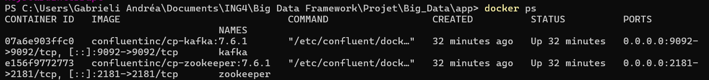
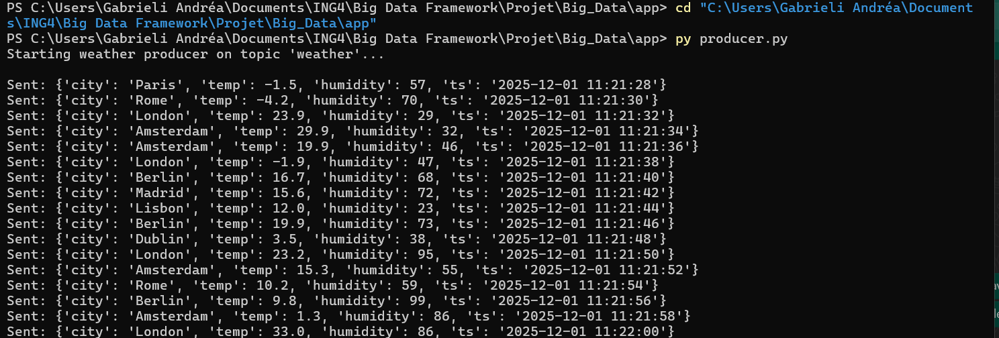
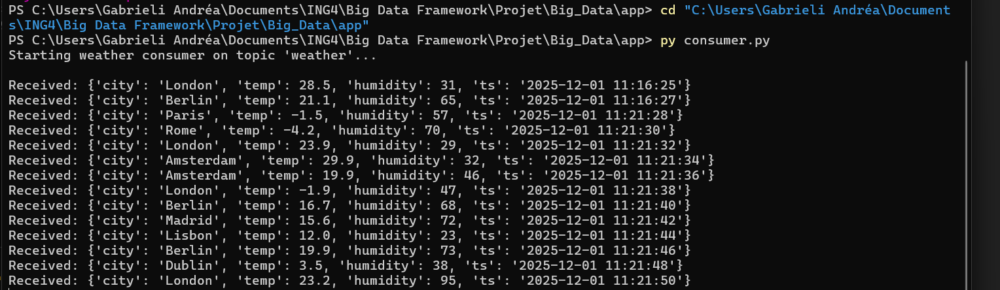

# Real-Time Weather Data Stream with Kafka

## 1. Project description
Small Big Data project using Apache Kafka to simulate a real-time weather data stream.
A Python producer sends fake weather events (temperature, humidity, city, timestamp),
and a Python consumer reads them in real time.

## 2. Chosen tool: Apache Kafka
Apache Kafka is a distributed event streaming platform capable of handling trillions of events per day.
## 3. Why Kafka?
Kafka is a distributed messaging and streaming platform.  
It is well suited for this project because:

- It can handle a continuous flow of events in real time.
- Producers and consumers operate independently.
- Events are stored in a durable log, so other tools (Spark, Flink, databases…) can also read the same stream.
- It is a very common component in modern Big Data architectures (data pipelines, IoT, log collection, etc.).

## 4. Installation steps
Prerequisites

Docker & Docker Compose installed
Python 3.8+ with kafka-python library

1. Clone the repository:

   git clone https://github.com/Andrea180904/Big_Data.git
   cd Big_Data

2. Start Kafka and Zookeeper using Docker Compose:

   docker compose up -d

3. Check that the containers are running:

   docker ps

Kafka and Zookeeper containers running (docker ps):

## 5. Minimal working example
This project simulates a real-time weather stream.

#### 5.1 Producer (Python)

The producer generates fake weather events every 2 seconds
(city, temperature, humidity, timestamp) and sends them to a Kafka topic
called "weather".
Producer sending weather events:

To run it:

cd app
py producer.py

#### 5.2 Consumer (Python)

The consumer subscribes to the same "weather" topic and prints all incoming
messages in real time.

Consumer receiving the events:

To run it:

cd app
py consumer.py

#### 5.3 Example messages

Example JSON message produced and consumed:

{"city": "Paris", "temp": 25.9, "humidity": 77, "ts": "2025-12-01 11:16:03"}

Screenshots in the `screenshots/` folder show:
- the producer sending messages,
- the consumer receiving the same messages.

## 6. How this fits in a Big Data ecosystem
In a real Big Data architecture, Kafka is rarely used alone.  
Our simple demo can be seen as the first step of a larger pipeline:

IoT sensors (weather stations) --> Kafka topic ("weather") --> 
stream processing engine (Spark / Flink) --> 
data lake or database (HDFS, S3, warehouse) --> 
dashboards / alerts for users.

In this project, we only implement:
- the "sensors" (simulated by the Python producer),
- the Kafka broker (via Docker),
- a simple consumer (Python) that reads and displays the stream.

But the same topic could be reused by:
- a stream processing job that computes rolling averages,
- a storage connector that writes data into a data lake,
- an alerting service (e.g. if temperature goes above a threshold).

## 7. Challenges & troubleshooting
During the setup we faced several issues:

- **Docker images not found (Bitnami)**  
  The initial docker-compose used Bitnami images (bitnami/kafka:3.7, bitnami/zookeeper:3.9).
  These tags were not available anymore, so Docker failed to pull them.
  We solved this by switching to Confluent images (confluentinc/cp-kafka and cp-zookeeper).

- **Kafka broker not reachable on port 9092**  
  The Python consumer raised `NoBrokersAvailable`.  
  This was due to a wrong listener configuration in Kafka.  
  We fixed it by explicitly setting:

  - KAFKA_LISTENERS=PLAINTEXT://0.0.0.0:9092  
  - KAFKA_ADVERTISED_LISTENERS=PLAINTEXT://localhost:9092

  After that, `Test-NetConnection localhost -Port 9092` succeeded and
  the Python client could connect.

- **Git conflicts on docker-compose.yml**  
  The file was edited both on GitHub and locally, which created a merge conflict.
  We resolved it by keeping the local version (with Confluent config),
  then using `git add` and `git rebase --continue` before pushing.

## 8. My Setup Notes
At the beginning we never run Kafka locally, so we learned:

- how to start Kafka and Zookeeper with Docker Compose,
- how client configuration (bootstrap servers, listeners, advertised listeners)
  directly impacts the ability for applications to connect,
- how to simulate a real-time data stream in Python,
- how to debug typical errors such as "NoBrokersAvailable",
- how to solve a small Git conflict during a rebase.

This small project helped us to understand Kafka not only from a theoretical point of view, but also from a very practical DevOps point of view (containers, ports, configuration, logs, etc.).We also gained experience with Git workflows.It will be useful for us, especially if we have an internship as data engineers.Most importantly, this project helped us to use what we learned in class in real practice.

## 9. Folder structure
- docker-compose.yml
- producer/
- consumer/
- screenshots/
